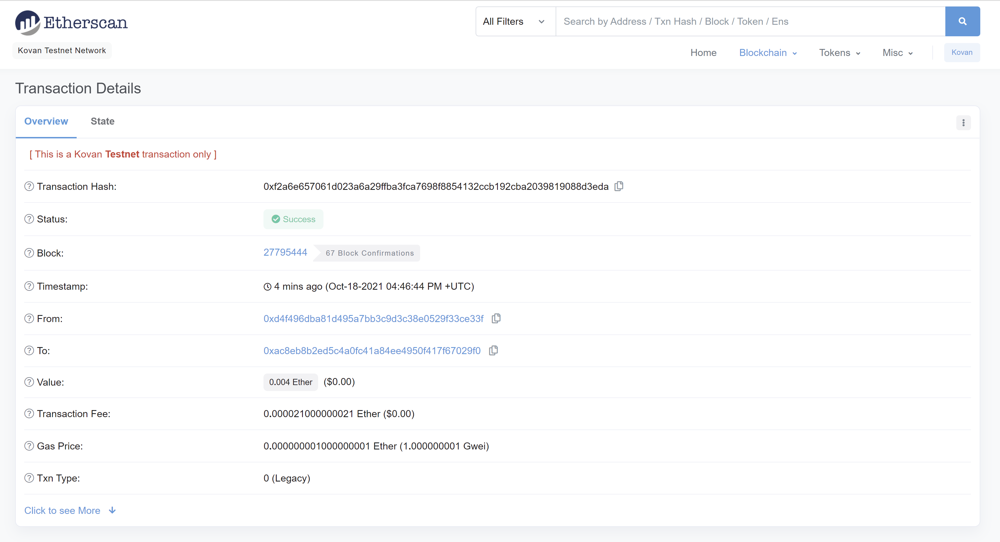

# FinTech Finder

# Program
 
 The program is set to integrate the Ethereum Blockchain network into the application in order to enable customers to instantly pay our list of FinTech professionals for their services. 

Below, you will find an image of the webpage with the user interface:


Lastly, here is an example of the following transaction recorded on the blockchain:



---

# Technologies

The following technologies were used in the creation of this PyChain:

```python
import streamlit as st
from dataclasses import dataclass
from typing import Any, List
import os
import requests
from dotenv import load_dotenv
load_dotenv()
from bip44 import Wallet
from web3 import Account
from web3.auto.infura.kovan import w3
from web3 import middleware
from web3.gas_strategies.time_based import medium_gas_price_strategy
```

---

# Contributors

This program is brought to you by `billybishop21`

---

# License

MIT License

Copyright (c) 2021 `billybishop21`

Permission is hereby granted, free of charge, to any person obtaining a copy of this software and associated documentation files (the "Software"), to deal in the Software without restriction, including without limitation the rights to use, copy, modify, merge, publish, distribute, sublicense, and/or sell copies of the Software, and to permit persons to whom the Software is furnished to do so, subject to the following conditions:

The above copyright notice and this permission notice shall be included in all copies or substantial portions of the Software.

THE SOFTWARE IS PROVIDED "AS IS", WITHOUT WARRANTY OF ANY KIND, EXPRESS OR IMPLIED, INCLUDING BUT NOT LIMITED TO THE WARRANTIES OF MERCHANTABILITY, FITNESS FOR A PARTICULAR PURPOSE AND NONINFRINGEMENT. IN NO EVENT SHALL THE AUTHORS OR COPYRIGHT HOLDERS BE LIABLE FOR ANY CLAIM, DAMAGES OR OTHER LIABILITY, WHETHER IN AN ACTION OF CONTRACT, TORT OR OTHERWISE, ARISING FROM, OUT OF OR IN CONNECTION WITH THE SOFTWARE OR THE USE OR OTHER DEALINGS IN THE SOFTWARE.

---